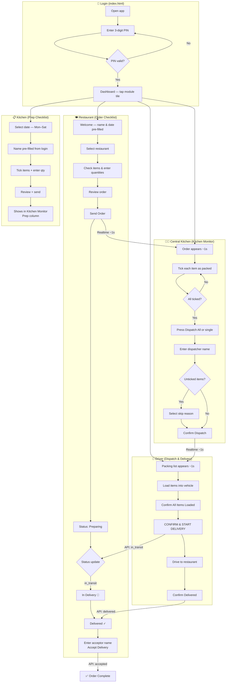
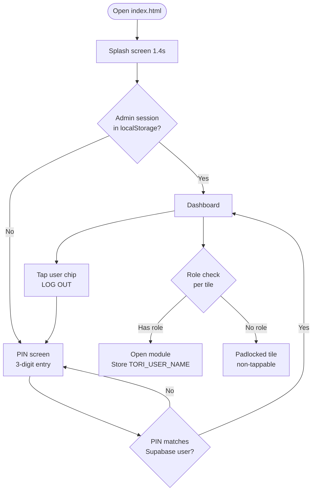
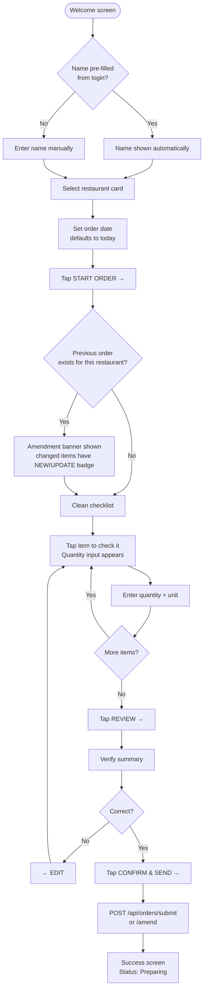
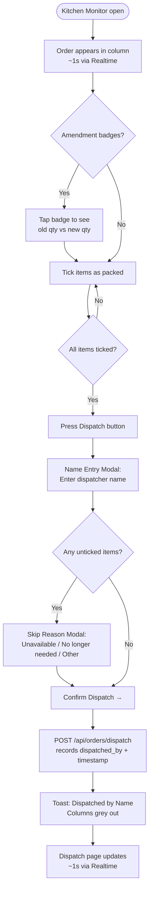
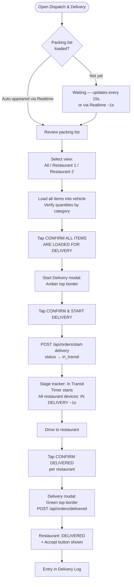
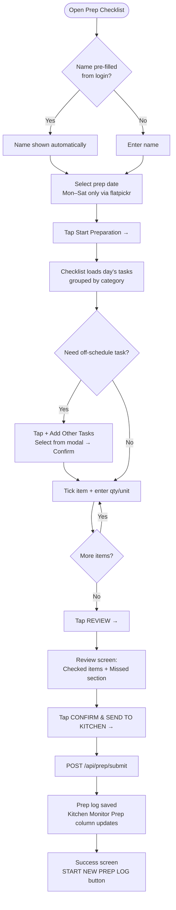
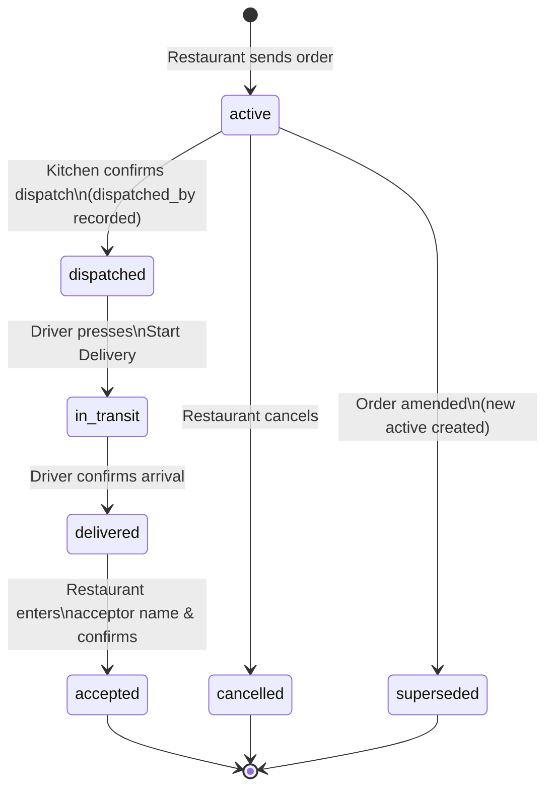
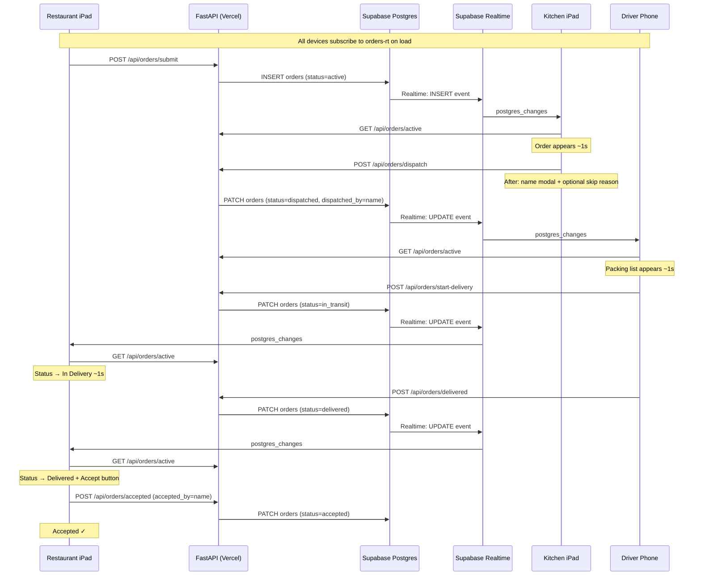

# TORI Kitchen Information System (KIS) v01
## Complete Project Documentation

**Version:** 1.0.0  
**Last updated:** 2026-06-29  
**Status:** Live in production  
**Production URL:** `https://tori-kitchen-system.vercel.app`

---

## Table of Contents

1. [Project Overview](#1-project-overview)
2. [Scope & Constraints](#2-scope--constraints)
3. [System Architecture](#3-system-architecture)
4. [Module Inventory](#4-module-inventory)
5. [Order Status Lifecycle](#5-order-status-lifecycle)
6. [Workflows & Diagrams](#6-workflows--diagrams)
7. [Voiceover Scripts — Module Walkthroughs](#7-voiceover-scripts--module-walkthroughs)

---

## 1. Project Overview

TORI KIS is a real-time kitchen information and order coordination system for TORI restaurant group. It connects two restaurant locations with a central kitchen, managing the full daily flow from food order submission through kitchen preparation, dispatch, driver delivery, and receipt confirmation. A separate prep checklist module tracks the kitchen's own daily prep tasks independently of incoming orders.

All devices sync in real time through Supabase Realtime WebSocket subscriptions, with a 15-second polling fallback. Staff authenticate with a personal 3-digit PIN before accessing any module.

**Restaurant locations:**

| Key | Display Name |
|-----|-------------|
| r1 | Tori 1 — Špansko |
| r2 | Tori 2 — Trnje |

---

## 2. Scope & Constraints

### In Scope
- Staff authentication with role-based module access
- Daily food order submission from two restaurant locations
- Real-time order monitoring at the central kitchen with item-level dispatch tracking
- Prep checklist tracking for kitchen daily tasks (independent of orders)
- Dispatch coordination and packing list management for the driver
- Delivery tracking with driver start confirmation
- Delivery receipt acceptance by restaurant staff including missing-item reporting
- Order history and delivery audit log
- Admin panel for managing users, order items, and order units

### Out of Scope
- POS or financial transactions
- Stock / inventory management
- Supplier ordering
- Nutritional or allergen tracking

### Locked Constraints
- **Soft-delete only:** Items are never hard-deleted from the database. Removing an item sets `archived = true`. No hard-deletes.
- **Service-role writes only:** All data writes go through the FastAPI backend using the Supabase service-role key. The browser anon key has SELECT-only access on `orders` (Realtime only).
- **No build step:** All pages are self-contained static HTML with inline CSS and JS. No framework, no bundler.
- **Encoding:** HTML files must be saved as UTF-8 without BOM. Never use PowerShell `Set-Content -Encoding UTF8` on these files — it adds a BOM and corrupts Croatian characters (čšđž) on the Windows-1252 host system. Use only the Edit/Write tool.
- **Deployment pipeline:** GitHub is the single source of truth. Changes must be pushed to GitHub; Vercel deploys automatically from the main branch. Never edit the local Google Drive snapshot directly.
- **Admin code:** The Admin panel PIN is a hardcoded 4-digit code (`admin.html`, `ADMIN_CODE = '2601'`). User PINs are 3-digit and stored in Supabase.

---

## 3. System Architecture

### Technology Stack

| Layer | Technology |
|-------|-----------|
| Frontend | Static HTML5 / CSS3 / Vanilla JS (no framework) |
| Date picker | Flatpickr (CDN, prep checklist only) |
| Backend API | FastAPI (Python) on Vercel Serverless |
| Database | Supabase (PostgreSQL) |
| Real-time | Supabase Realtime (`postgres_changes`) via `@supabase/supabase-js@2` UMD from jsDelivr |
| Hosting | Vercel (auto-deploy from GitHub `main` branch) |

### Database Tables

| Table | Purpose |
|-------|---------|
| `orders` | All food orders — active, in-progress, historical |
| `users` | Staff users with 3-digit PINs and role groups |
| `order_items` | Master item catalog with units, categories, dual-unit config |
| `order_units` | Unit definitions (kg, L, pcs, boxes, etc.) |
| `prep_logs` | Kitchen prep checklist submissions |
| `prep_tasks` | Custom prep task definitions |

### Key Database Configuration
- `orders` RLS is enabled with an anon `SELECT` policy (`USING (true)`) for Realtime.
- `orders` uses `REPLICA IDENTITY FULL` so UPDATE/DELETE events carry full row data under RLS.
- `orders` is included in the `supabase_realtime` publication.
- Writes to all tables go through the service-role backend; the anon role cannot write.

### `orders.status` Values (CHECK constraint enforced)

```
active → dispatched → in_transit → delivered → accepted
                   ↘ cancelled
```

Also valid: `superseded` (order replaced by an amendment).

### API Endpoints

| Method | Endpoint | Action |
|--------|----------|--------|
| GET | `/api/orders/active` | Returns active orders, in-progress orders, history, and active prep log |
| POST | `/api/orders/submit` | Submit new order (supersedes previous active for same restaurant) |
| POST | `/api/orders/amend` | Amend an order (supersedes current active) |
| POST | `/api/orders/cancel` | Cancel active order |
| POST | `/api/orders/dispatch` | Kitchen dispatches → `dispatched`; records `dispatched_by` and timestamp |
| POST | `/api/orders/start-delivery` | Driver starts run → `in_transit` |
| POST | `/api/orders/delivered` | Confirm delivery → `delivered`; records `delivered_at` |
| POST | `/api/orders/accepted` | Restaurant accepts receipt → `accepted`; records `accepted_by` |
| POST | `/api/prep/submit` | Submit or merge prep log |
| POST | `/api/prep/clear` | Mark active prep as cleared |
| POST | `/api/prep/tick` | Tick/untick individual prep item |
| GET | `/api/prep/tasks` | List custom prep tasks |
| POST | `/api/prep/tasks` | Save new custom prep task |
| GET | `/api/prep/history` | Cleared prep history |
| POST | `/api/kitchen/clear-active` | Admin: clear all active orders |
| POST | `/api/kitchen/clear-dispatched` | Admin: clear stuck dispatched orders |

### File Structure

```
tori-kitchen-system/
├── api/
│   └── index.py                    # FastAPI backend (Vercel Serverless)
├── index.html                      # Login + home dashboard (entry point)
├── admin.html                      # Admin panel
├── tori-order-checklist.html       # Module: Restaurant order submission
├── tori-kitchen-system.html        # Module: Central kitchen monitor
├── tori-dispatch-delivery.html     # Module: Dispatch & delivery
├── tori-prep-checklist.html        # Module: Kitchen prep checklist
├── vercel.json                     # Vercel routing config
└── requirements.txt                # Python dependencies
```

### Shared LocalStorage Keys (cross-module)

| Key | Set by | Read by | Content |
|-----|--------|---------|---------|
| `TORI_USER_NAME` | index.html (on module open) | All modules | Logged-in user's name (auto-fills name fields) |
| `TORI_USER_GROUPS` | index.html (on module open) | Modules | JSON array of role groups |
| `TORI_SESSION` | index.html | index.html, admin.html | Session object (admin role only persists across reload) |
| `TORI_ORDERS` | Order checklist | Kitchen monitor, dispatch | Active order data (fallback) |
| `TORI_DISPATCH` | Kitchen monitor | Dispatch page | Latest dispatch snapshot |
| `TORI_STATUS` | Kitchen monitor, dispatch | Order checklist | Per-restaurant status object |
| `TORI_CATALOG_V1` | Any module on first load | All modules | Cached order item catalog from Supabase |

---

## 4. Module Inventory

### Login & Home Dashboard (`index.html`)

**Who uses it:** All staff  
**Purpose:** Authenticate with a 3-digit PIN and navigate to assigned modules.

#### Splash Screen
- Displays for ~1400ms on every page load
- Animated TORI logo with orbiting ellipses
- Skipped if an admin session is already stored in `TORI_SESSION`

#### PIN Screen
- Label: "Enter Your PIN" / "3-digit personal PIN"
- 3 PIN dot indicators (fill red as digits are entered)
- Numeric keypad (1–9 grid, wide 0 button, DEL button)
- **Auto-submits after the 3rd digit** (150ms delay) — no need to press a confirm button
- Wrong PIN: dots flash red, keypad shakes, error message "Incorrect PIN. Try again."
- Network failure: "Connection error. Check internet."
- PIN validation: fetches `GET /rest/v1/users?pin=eq.{PIN}` from Supabase (anon key)
- On success: saves `TORI_SESSION` to localStorage and shows dashboard

#### Home Dashboard
- TORI logo + "KITCHEN INFORMATION SYSTEM" in top bar
- Logged-in user name shown in bottom chip ("● NAME · LOG OUT")
- Tap the chip to log out (clears `TORI_SESSION`, returns to PIN screen)

**Module tiles (2-column grid):**

| Tile Label | Required Role | Opens |
|------------|--------------|-------|
| Kitchen Order | `order` | `tori-order-checklist.html` |
| Preparation Kitchen Display | `display` | `tori-kitchen-system.html` |
| Preparation List | `prep` | `tori-prep-checklist.html` |
| Delivery | `delivery` | `tori-dispatch-delivery.html` |
| Admin | `admin` | `admin.html` (only rendered if user has admin) |

- Tiles the user does not have access to show a padlock badge and are non-tappable
- On tile tap: stores `TORI_USER_NAME` and `TORI_USER_GROUPS` to localStorage, then opens the module
- Keyboard: digit keys 0–9 work on PIN screen; Backspace deletes

#### Role / Group System

Roles are stored in the `users.groups` column in Supabase as an array. Groups map to accessible modules:

| Group | Accessible modules |
|-------|--------------------|
| `kitchen` | order |
| `management` | order, prep, delivery |
| `delivery` | delivery |
| `order` | order |
| `display` | display |
| `prep` | prep |
| `admin` | order, display, prep, delivery, admin |

Session persistence: only admin users have their session persisted across page reloads (`PERSISTENT_ROLES = ['admin']`). All other users must re-enter their PIN after the page is refreshed.

---

### Module 1 — Order Checklist (`tori-order-checklist.html`)

**Who uses it:** Restaurant staff at Tori 1 and Tori 2  
**Device:** iPad at each restaurant  
**Purpose:** Submit daily food orders and track delivery status in real time.

#### Screens

**Welcome (s-welcome)**
- Top navigation tabs: **Home** | **Delivery** | **History**
- Settings button (⚙) — opens settings screen
- **SELECT RESTAURANT** — two cards: "Tori 1 — Špansko" and "Tori 2 — Trnje"
  - Tapping selects the card (red left border highlight, radio dot fills)
  - Last selection restored from `localStorage.TORI_LOCATION`
- **Date** (`ORDER DATE`) — date input, defaults to today
- **Your Name & Surname** — text input, **auto-populated from `TORI_USER_NAME`** (set by login)
  - User can still edit it manually
- **START ORDER →** button (red, full width, fixed at bottom)
  - Disabled until restaurant selected AND name entered

**When an active or in-progress order exists for the selected restaurant, the welcome screen also shows:**
- Current status banner (Preparing / In Delivery / Delivered)
- Context buttons: "AMEND ORDER" (if still preparing), "CANCEL ORDER", or "VIEW STATUS →"

**Checklist (s-checklist)**
- Sticky header: TORI logo, restaurant tag pill, order date, staff name
- Category progress bar (dots per category, fills as categories are completed)
- **Amendment banner** (amber, shown when amending): "⚠ Amending sent order — changes will be re-sent"
- **Jump dropdown** — jump to any category by name with item count
- **Search box** — real-time search across all items; clear button appears when active
- Items organised by category (PRODUCE, PROTEINS, DAIRY, etc.) with sticky category headers
- **Item row (unchecked):** checkbox (grey) + item name (uppercase)
- **Item row (checked):** checkbox turns green with ✓; quantity input + unit input appear inline; quantity badge preview shown
- Dual-unit items show formatted output (e.g., "2 boxes (48 pieces)")
- Amendment badges on items:
  - Red **NEW** badge (pulsing) — item not in previous order
  - Amber **UPDATE** badge (pulsing) — quantity changed from previous order
- Bottom nav: **← BACK** | **REVIEW →** (disabled until ≥1 item checked with qty > 0)

**Review (s-review)**
- Title: "Review Order" / "Check everything before sending to kitchen"
- Order meta: restaurant tag, date, staff name
- Amendment notice (amber): "⚠ This will amend the previously sent order" (if amending)
- Full item list grouped by category (name + quantity, read-only)
- Empty state if no items selected
- Footer: **← EDIT** | **CONFIRM & SEND →** (red, disabled if no items)

**Success / Status (s-success)**
- Animated green checkmark + "ORDER SENT" on first load
- Transitions to delivery status tracker

**Home tab** (on welcome screen, after order sent)
- Quick status banner with current stage
- Context buttons based on status

**Delivery tab** (on welcome and on success screen)
- Three-stage status bar: **PREPARING → IN DELIVERY → DELIVERED**
  - Active stage: green pulsing dot + white text
  - Completed stages: green solid dot
  - Future stages: grey dim dot
  - Each reached stage shows its timestamp
- Dispatch details: dispatched at, dispatched by
- Delivery details (once delivered): delivered at, driver name
- Item list (when delivered):
  - OK items: green background, green checkmark
  - Missing items: red background, name struck through, reason tag ("Not Delivered", "Damaged", "Other")
  - Tapping a missing item opens **Mark as Missing modal** (reason selection)
- **ACCEPT DELIVERY** button (green, full width) — shown when status is `delivered`
  - Opens **Confirm Delivery Accepted modal** — requires acceptor name input
  - On confirm: `POST /api/orders/accepted` with `accepted_by` name
  - Button becomes "ACCEPTED ✓" (disabled)

**History tab**
- List of past orders: date, restaurant, item count, status
- Entries loaded from `TORI_RESTAURANT_LOG` localStorage
- Accepted entries show green "accepted" badge

#### Key Flows
- **Amend Order** (`startAmend()`): sets `isAmending = true`, returns to checklist with items pre-filled. Submits as `/api/orders/amend` (supersedes current active).
- **Cancel Order** (`cancelOrder()`): confirmation dialog → `POST /api/orders/cancel` → welcome screen reset.
- **Mark as Missing** modal: reason options — "Not Delivered", "Damaged", "Other". Saved locally; displayed in delivery detail.
- **Accept Delivery** modal: name + surname field required before confirming.

#### Status Mapping (API → Display)

| API `status` | Display label | Visual |
|-------------|---------------|--------|
| `active` | Preparing | Amber pulsing |
| `dispatched` | Preparing | Amber pulsing (items packed, driver loading) |
| `in_transit` | In Delivery | Green pulsing |
| `delivered` | Delivered | Green + Accept button |
| `accepted` | Accepted ✓ | Green, no button |

#### Real-Time
- Supabase Realtime channel `orders-rt` on table `orders` — any event triggers `syncStatusFromAPI()`
- Toast on status change: "🚚 Your order is on the way!" and "✓ Your order has arrived!"
- Fallback poll every 15 seconds

#### LocalStorage Keys (module-specific)

| Key | Purpose |
|-----|---------|
| `TORI_LOCATION` | Last selected restaurant (`r1` or `r2`) |
| `TORI_RESTAURANT_LOG` | Accepted delivery history entries |
| `CATALOG_CACHE_KEY` | Cached item catalog |

---

### Module 2 — Central Kitchen Monitor (`tori-kitchen-system.html`)

**Who uses it:** Head chef / kitchen coordinator  
**Device:** iPad or wall display at central kitchen  
**Purpose:** Monitor incoming orders in real time, tick items as they are packed, dispatch orders, and track prep checklist status.

#### Top Navigation Bar
- **TORI** logo + "CENTRAL KITCHEN" label + pulsing red dot
- Three tabs: **CENTRAL** (badge: active order count) | **PREP** (badge: prep item count) | **HISTORY** (badge: history count)
- **↻ Sync** button — manual `fetchAll(true)`
- **⚙ Settings** button — opens settings modal
- Live clock (HH:MM:SS)
- API status dot: green = connected, red = error

#### Central Tab (s-central) — 3-Column Layout

**Column 1: PREP**
- Shows active prep log from `/api/orders/active` → `data.prep`
- Items grouped by category with sticky headers
- Each item: checkbox + name (uppercase) + quantity + unit badge
- Checked items: green ✓, strikethrough name, reduced opacity
- Ticking/unticking: `POST /api/prep/tick` (persists server-side)
- Header shows ticked / remaining counts
- **Clear Prep List** button (green) — appears only when ALL items are ticked
  - Calls `POST /api/prep/clear`

**Columns 2 & 3: Tori 1 — Špansko (R1) and Tori 2 — Trnje (R2)**

Both columns are identical in structure:
- Column header: restaurant name, order timestamp, staff name who submitted
- Empty state: "NO ORDERS"
- Category sticky headers
- **Item rows:**
  - Dispatch checkbox (outlined → green ✓ when ticked)
  - Ticked items: greyed text, strikethrough
  - Item name (uppercase) + quantity + unit
  - **Amendment badges** (pulsing):
    - Red **NEW** — item not in previous order
    - Amber **UPDATE** — quantity changed
  - Tap any badge → **Amendment Detail Popup** (red top border):
    - Previous quantity (strikethrough, grey)
    - Arrow →
    - New quantity (red, bold)
    - Dismiss button
- Dispatch tick state persisted in `localStorage.TORI_PREV_ORDER`

**Footer Statistics:**
- Active Orders count
- Preparation: `done / total`
- Dispatch Ready: `ticked / total order items`

**Dispatch Buttons:**
- **"Dispatch Only Tori 1 — Špansko"** — shown when R1 has active order
- **"Dispatch Only Tori 2 — Trnje"** — shown when R2 has active order
- **"Dispatch All →"** (green) — shown when 1+ restaurants have active orders
- All buttons disabled until all items in scope are ticked

#### Dispatch Flow (4 steps)

1. **Name Entry Modal** — "Dispatch — [Restaurant/Both]"
   - Input: dispatcher name (required — enables "Proceed →" button)
   - On confirm: checks for unticked items

2. **Skip Reason Modal** (if any items unticked) — "Dispatch — Items Not Ticked"
   - Warning: "X items not ticked"
   - Unticked item chips shown
   - Reason options: "Unavailable" | "No longer needed" | "Other" (reveals free-text input)
   - "Confirm Dispatch →" enabled only when reason selected

3. **`doDispatchFull()`**
   - `POST /api/orders/dispatch` with `{ restaurant, dispatched_by: name, not_dispatched: {...} }`
   - Clears local dispatch tick state
   - Toast: "Dispatched by [Name]"

4. **UI update** — order columns grey out; dispatch page updates via Realtime within ~1s

#### Prep Tab (s-prep) — Preparation History
- Header: "Preparation History"
- Table: Date | ID | Cleared At | Status
- Rows clickable → **Prep Detail Sheet** (slides from right):
  - Date, staff name, item list by category, which items were ticked and at what time

#### History Tab (s-history) — Delivery History
- Header: "Delivery History"
- Table: Restaurant | ID | Ordered By | Submitted | Dispatched By | Dispatched | Status
- Rows clickable → **Kitchen Detail Sheet** (slides from right):
  - Full meta (ordered by, dispatched by, timestamps), all items by category, missing items section

#### Settings Modal
- **Admin Mode toggle** — reveals:
  - "Import History from Database" — fetches history from API
  - "Force Refresh Page" — `location.reload(true)`
  - "Clear All Active Orders" (red) — `POST /api/kitchen/clear-active`
  - "Clear Local History" (red) — clears localStorage history keys
- App version: "v1.0.0" (read-only)

#### Real-Time
- Supabase Realtime channel `orders-rt` — any event triggers `fetchAll(true)`
- Fallback poll every 15 seconds
- Auto-reconnect after 3 seconds on disconnect

#### Key LocalStorage Keys

| Key | Content |
|-----|---------|
| `TORI_PREV_ORDER` | `{r1: {orderId, items}, r2: {orderId, items}}` — amendment detection |
| `TORI_PREP_HIST_HIDDEN` | Set of hidden prep IDs (soft-hide, not delete) |

---

### Module 3 — Dispatch & Delivery (`tori-dispatch-delivery.html`)

**Who uses it:** Delivery driver  
**Device:** Phone or tablet in the vehicle  
**Purpose:** View packing lists, confirm items loaded, start delivery timer, confirm arrival.

#### Top Navigation Bar
- **TORI** logo + "Dispatch" label + pulsing red dot
- Two tabs: **Packing Lists** (badge: live order count) | **Delivery Log** (badge: history count)
- Live clock (HH:MM:SS) + date (DD-MM-YYYY)
- **⚙ Settings** button
- **✕ CLOSE** button (closes window)

#### Packing Lists Tab (s-packing)

**View Toggle Strip:**
- **All Deliveries** — both R1 and R2 side by side (default)
- **Restaurant 1** — single column for Tori 1 only
- **Restaurant 2** — single column for Tori 2 only

**Stage Tracker (pill-style horizontal bar):**
- Pills: **Dispatched** → **In Transit** → **Delivered** → **Accepted**
- Active stage: white text, white border, pulsing animation, live elapsed timer (MM:SS)
- Inactive stages: grey, no timer

**Packing list auto-appears within ~1 second of kitchen pressing DISPATCH** (Supabase Realtime)

**Per-restaurant packing column:**
- Header: restaurant name (R1 = white text, R2 = lighter grey)
- Category sticky headers (same categories as order)
- Item rows: name + large quantity number + unit
- No checkboxes (read-only packing reference)

**Delivery Footer Buttons:**
- **"Confirm All Items Are Loaded for Delivery"** (green, pulsing) — opens Start Delivery modal
- **"Confirm Delivered"** (large amber, 260×120px, centered per restaurant) — opens delivery confirmation modal
- After both restaurants delivered: columns show green delivered state

#### Start Delivery Modal (`#load-check-modal`) — amber top border
- Title: "Start Delivery"
- Subtitle: "Confirm all items are loaded and ready for delivery."
- Button: **"CONFIRM & START DELIVERY"** (amber)
- Driver name taken from URL param `?user=` or `TORI_USER_NAME` localStorage (no input shown — set automatically)
- On confirm: `POST /api/orders/start-delivery` per restaurant → status `in_transit`
- All restaurant devices immediately see "In Delivery" (~1 second via Realtime)
- Toast: "Delivery started — [driver name]"

#### Confirm Delivered Modal (`#dmodal`) — green top border
- Title: "Confirm Delivery — [Restaurant Name]"
- Button: **"CONFIRM DELIVERY"** (green)
- On confirm: `POST /api/orders/delivered` → status `delivered`
- Entry added to Delivery Log

#### Delivery Log Tab (s-log)
- Header: "DELIVERY LOG" + total count
- Table: Date | Day | Time | Restaurant | Items | Status
- Rows clickable → **Log Detail Sheet** (slides from right):
  - Meta: ordered by, ordered at, dispatched by, dispatched at, delivered by, delivered at
  - Full item list by category with quantities

#### Settings Modal
- Admin Mode toggle — reveals:
  - "Import History from Database"
  - "Force Refresh Page"
  - "Clear Delivery History" (red)
- App version: v1.0.0

#### Real-Time
- Supabase Realtime channel `orders-all` — any event triggers `loadDispatchFromAPI()`
- Fallback: `setInterval(loadDispatchFromAPI, 15000)` when no active batch loaded

#### Key LocalStorage Keys

| Key | Content |
|-----|---------|
| `tori_delivery_log` | Persistent delivery history array |
| `TORI_DRIVER_NAME` | Cached driver name |

---

### Module 4 — Prep Checklist (`tori-prep-checklist.html`)

**Who uses it:** Head chef / kitchen prep staff  
**Device:** iPad or phone in the kitchen  
**Purpose:** Track and submit the kitchen's own daily prep tasks (independent of restaurant orders).

#### Top Navigation (header tabs)
- **PREP** tab (active by default)
- **HISTORY** tab
- **⚙ Settings** button
- "Clear All ✕" button (only on history tab)

#### Welcome / Prep Setup Screen (s-welcome)

- **YOUR NAME** — text input; pre-populated from `TORI_USER_NAME` (set by login)
- **PREPARATION DATE** — date picker (flatpickr); Mon–Sat only (Sunday = closed, disabled)
  - Defaults to today
  - Display format: DD-MM-YYYY
- **"Start Preparation →"** button (red) — disabled until date selected

#### Checklist Screen (s-checklist)

- Sticky header: TORI logo + day tag (e.g., "Monday") + prep date
- Tasks pre-loaded by day of week from a defined weekly schedule
- Category sticky sections: **SAUCES** | **FOODS** | **VEGETABLES** | **OTHER**
  - "Added" section (grey border, lighter bg) for manually-added off-schedule tasks
- **Item row (unchecked):** checkbox + item name (uppercase) + "scheduled" meta
  - Off-schedule/custom items show "Added manually" meta in red
- **Item row (checked):** green ✓ checkbox; **quantity input** + **unit input** appear inline at right
  - Qty input: number field (green bottom border), 78px wide
  - Unit input: text field (editable), 56px wide, pre-filled from task definition
- **"+ Add Other Tasks" button** (full-width, red) — opens **Add Other Items modal**
  - Shows off-schedule tasks not yet in today's list
  - Multi-select, then "SELECT ITEMS TO ADD" confirms
- Bottom nav: **← CANCEL** | **REVIEW →**

#### Review Screen (s-review)

- Title: "REVIEW PREPARATION" / "Check before sending"
- Meta panel: date, scheduled count, checked count, missed count
- **Missed items** section (amber border, collapsible) — shows scheduled-but-unchecked tasks
- Checked items grouped by category (name + quantity, read-only)
- Footer: **← EDIT** | **"CONFIRM & SEND TO KITCHEN →"** (red, disabled if no items checked)

#### Success Screen (s-success)

- Green checkmark + "PREP LOG SUBMITTED" + item count
- **"START NEW PREP LOG"** button → returns to welcome

#### History Tab (s-history)

- List of all submitted prep logs (newest first)
- Each entry: date + day + item count
- Tap any entry → **Detail Modal** (centered overlay):
  - Date, day, items by category, quantities
  - Close with ✕ or tap outside

#### Settings Screen (s-settings)

- **← Back** button to welcome
- **Admin Mode** toggle (checkbox)
- **Sort toggle** (A–Z / Z–A) — re-renders task list
- **Edit toggle** — reveals per-task controls:
  - Day-of-week checkboxes per task (Mon–Sat)
  - Delete button (×) per task — soft-deletes to `tori_deleted_ids`
  - "+ Add New Task" section: name input + unit input + day checkboxes → "SAVE" | "CANCEL"
- **"RESET TO DEFAULT"** button (red) — restores all default tasks, removes custom tasks and deletions

#### Task Schedule

Tasks are pre-defined with a `days` array (0=Mon … 5=Sat). Examples by category:

**Sauces** (12 tasks, mostly Tuesday): Dan Dan Sauce, Goma Tare, Gyoza Sauce, Kimchi Paste, Kung Pao Sauce, Laksa Base, Poke Sauce, Pork Belly Glaze, Soy Tare, Sunomono Sauce, Sushi Vinegar, Teriyaki Sauce

**Foods** (29 tasks, varied days): Chicken Thighs (daily), Sushi Rice (daily), Tuna Poke (daily), Bamboo Cook, Beef Stripes, Chicken Miso, Chicken Stock, Coleslaw, Crumble, Dan Dan Pork, Egg Marinade, Gyoza Pork, Ice Cream Takeaway, Katsu Chicken, Kimchi, Lobster Salad, Peanuts Grind, Pork Belly (Prep/Bake/Cut), Ramen Eggs, Ramen Noodles, Ramen Soup, Shiitake Soak, Tofu Cutting, Tofu Panko, Vimixa Noodles, Banana Bread, Tempura Roll

**Vegetables** (9 tasks, mostly daily): Chilli Cutting, Cucumber Marinade, Cucumbers Cutting, Daikon Marinate, Green Beans, Pak Choi, Purple Onion, Shiitake Cutting, Spring Onion

#### Submission Flow
- `POST /api/prep/submit` with `{prep_date, day_name, user_name, items: [{id, qty, unit}...]}`
- Server merges into active prep log (or creates new if none active)
- Kitchen Monitor's Prep column shows the active prep log
- History saved locally in `TORI_PREP_LOG` and server-side in `prep_logs` table

#### Key LocalStorage Keys

| Key | Content |
|-----|---------|
| `tori_prep_schedule_v1` | Task schedule overrides and custom tasks |
| `TORI_PREP_LOG` | Local history of submitted prep logs |
| `tori_deleted_ids` | Soft-deleted task IDs |
| `toriPrepAdmin` | Admin mode flag |

---

### Admin Panel (`admin.html`)

**Access:** Admin tile in index.html (requires `admin` role) or direct URL  
**Authentication:** Hardcoded 4-digit PIN `2601` (separate from user PINs)

#### Authentication Screen
- "Admin Panel" + "Enter 4-digit master code"
- 4 PIN dot indicators (same UI as login)
- Auto-submits after 4th digit (150ms delay)
- Wrong code: shake animation + "Incorrect code." message
- Auto-skip if admin `TORI_SESSION` already present in localStorage

#### Section 1: All Users
- User cards sorted by role priority then alphabetically
- Per user: avatar (first letter), name, role pills, PIN display, Edit + Delete buttons
- Role pill colors: kitchen/order = green, management/display = blue, delivery = gold, prep = purple, admin = red

**Add / Edit User form:**
- Full Name (text, required)
- 3-Digit PIN (numeric, required, must be unique across all users)
- Role Label (optional text)
- Module Access checkboxes: Order | Kitchen Display | Prep List | Delivery | Admin
  - Selecting Admin auto-adds all other modules
- "Save User" / "Cancel" / (in edit: "Delete User")
- Validation errors: "Enter a name", "PIN must be exactly 3 digits", "Select at least one role", "PIN already in use"

**Delete user:** confirmation prompt → `DELETE /rest/v1/users?id=eq.{id}`

All user reads/writes go to Supabase directly (anon key for reads, service key for writes).

#### Section 2: Order Units
- List of all units from `order_units` table
- Add/Edit modal: unit name field ("Box", "kg", etc.) → saved with `sort_order`
- Delete unit: removes from `order_units`

#### Section 3: Order Items
- Search bar (real-time filter) + category dropdown filter
- Item list: name, category, dual-quantity status badge, Edit + Archive buttons
- **Archive** = soft-delete (`archived = true`), never hard-delete

**Edit Item modal:**
- Item name
- **Show dual quantity** toggle:
  - Off: single unit display
  - On: reveals Order Unit dropdown (from `order_units`), Output Unit (read-only), Conversion factor ("1 {unit} = {factor} {output}")
  - Live preview updates as factor is typed
- Save / Cancel / Delete (archive)

**Add Item modal:**
- Item name, Category (dropdown), Output unit (text)
- Created as single-unit item; use Edit afterward for dual-quantity setup
- Slug auto-generated from name (collision handled by appending `_2`, `_3`, etc.)

#### Section 4: System — Clear Data
- Per-module status (Order, Kitchen Display, Delivery, Prep Checklist)
- Status indicator: green (clear), amber (has data), red (error)
- "Clear" button per module (disabled when already clear)
- Calls the respective `/api/*/clear` endpoint

---

## 5. Order Status Lifecycle

```
Restaurant submits        Kitchen packs        Driver loads        Driver arrives        Restaurant confirms
       │                        │                   │                    │                      │
    active ────────► dispatched ────────► in_transit ────────► delivered ────────────► accepted
       │
       ├──► superseded   (amended — old active replaced by new active)
       └──► cancelled    (cancelled before dispatch)
```

**What each status means across all devices:**

| DB status | Order Checklist shows | Kitchen Monitor shows | Dispatch & Delivery shows |
|-----------|----------------------|-----------------------|--------------------------|
| `active` | Preparing (amber) | Order in column, items unticked | — (not yet dispatched) |
| `dispatched` | Preparing (amber) | Items greyed, dispatch confirmed | Packing list loaded, stage: Dispatched |
| `in_transit` | In Delivery (green pulsing) | Greyed, in history | Stage: In Transit, timer running |
| `delivered` | Delivered + Accept button | In History tab | "Confirm Delivered" shown as done |
| `accepted` | Accepted ✓ | In History tab | In Delivery Log |

---

## 6. Workflows & Diagrams

### 6.1 Full System Workflow



---

### 6.2 Login & Navigation Flow



---

### 6.3 Order Submission Flow



---

### 6.4 Kitchen Dispatch Flow



---

### 6.5 Dispatch & Delivery Flow



---

### 6.6 Prep Checklist Flow



---

### 6.7 Order Status State Machine



---

### 6.8 Real-Time Sync Sequence



---

## 7. Voiceover Scripts — Module Walkthroughs

> Written for screen recording narration. Each step matches a visible on-screen action. Narrate each line as the action is performed.

---

### Script 1 — Logging In and Opening a Module
**Module:** Login Dashboard (`index.html`)  
**Perspective:** Any staff member, first time opening the app

---

**[SCREEN: Splash screen with TORI logo animation]**

"Every staff member starts here — the TORI login screen. When you first open the app, you'll see the TORI logo animate in for a moment, then the PIN screen appears."

---

**[SCREEN: PIN screen with 3 dot indicators and keypad]**

"Each person has their own three-digit PIN assigned by the admin. Enter your PIN by tapping the keypad — the dots fill in as you type. After the third digit, the system checks your PIN automatically. No need to tap a confirm button.

If the PIN is wrong, the dots flash red and you can try again."

---

**[SCREEN: Dashboard with module tiles]**

"When the PIN is accepted, the dashboard opens. You'll see your name at the bottom of the screen and the modules you have permission to use. Modules you don't have access to show a padlock icon — tapping them does nothing.

Tap the tile for the module you want to open."

---

**[SCREEN: Module opens]**

"The module opens immediately. Notice your name is already filled in — the system remembered it from your login so you never need to type it again."

---

### Script 2 — Submitting a Food Order (Restaurant Staff)
**Module:** Order Checklist (`tori-order-checklist.html`)  
**Perspective:** Restaurant staff placing the daily order

---

**[SCREEN: Welcome screen with TORI logo and restaurant cards]**

"This is the Order Checklist — the app used at each restaurant every morning to send that day's food order to the central kitchen.

When you open it, your name is already filled in from your login. Select your restaurant by tapping the card — Tori 1 for Špansko, or Tori 2 for Trnje. The card highlights in red when selected. The date defaults to today.

Tap START ORDER to open the checklist."

---

**[SCREEN: Checklist with categories and items]**

"The checklist shows all food items grouped by category — Produce, Proteins, Dairy, and so on. The category header stays visible as you scroll.

If you've ordered before, items that have changed from last time will have coloured badges — a red NEW badge for items not previously ordered, and an amber UPDATE badge for items with changed quantities. Tap any badge to see the exact difference between the old and new quantity.

To order an item, tap its row. The row expands and shows a quantity input. Enter the amount and move to the next item. Checked items show a green tick and their quantity. Skip any items you don't need."

---

**[SCREEN: Bottom navigation with REVIEW button]**

"The jump dropdown at the top lets you skip directly to any category. The search box filters items in real time if you need to find something quickly.

When all items are entered, tap REVIEW."

---

**[SCREEN: Review screen]**

"The review screen shows your complete order — restaurant, date, staff name, and every item with its quantity. Check everything is correct.

If you need to make a change, tap EDIT to go back. When ready, tap CONFIRM & SEND."

---

**[SCREEN: Success screen, then status view]**

"Order sent. The green checkmark confirms it. The kitchen has your order — it appeared on their screen within about one second.

The screen switches to the delivery tracker. The status shows Preparing — the kitchen is working on your order. Leave the screen on and the status updates automatically throughout the day. No refreshing needed."

---

**[SCREEN: Status changes to "In Delivery"]**

"When the driver loads the vehicle and starts the delivery, your status changes to In Delivery — you'll see the green pulsing indicator. This happened automatically the moment the driver pressed Start Delivery on their device."

---

**[SCREEN: Status changes to "Delivered" with Accept button]**

"When the driver arrives and confirms on their end, your status changes to Delivered. You'll also see the list of everything that was sent.

Check through the items. If anything is missing, tap the item to mark it as not received and select a reason. When you've confirmed everything that arrived, tap ACCEPT DELIVERY."

---

**[SCREEN: Accept Delivery modal with name field]**

"A confirmation box opens. Enter the name of the person accepting the delivery, then tap CONFIRM. The order is now marked as accepted and the record is complete."

---

**[SCREEN: Amend flow — amber AMEND ORDER button visible]**

"If you need to change your order while the kitchen is still preparing it, tap AMEND ORDER. The checklist reopens with your current quantities. Make your changes, go through review, and send. The kitchen sees the updated quantities highlighted with amendment badges."

---

### Script 3 — Monitoring & Dispatching Orders (Kitchen Staff)
**Module:** Central Kitchen Monitor (`tori-kitchen-system.html`)  
**Perspective:** Head chef or kitchen coordinator

---

**[SCREEN: 3-column layout — Prep, Tori 1, Tori 2]**

"This is the Central Kitchen Monitor — the main display for the central kitchen. It stays on all day and updates automatically.

The screen has three columns: Prep on the left, and the two restaurants — Tori 1 Špansko and Tori 2 Trnje — on the right. The green dot in the top bar shows the API is connected and live."

---

**[SCREEN: Prep column with checklist items]**

"The Prep column shows today's prep checklist submitted by the kitchen team. Tick each item as it's prepared — the checkbox turns green. The counter at the top tracks how many are done versus remaining.

When every item is ticked, a green Clear Prep List button appears at the bottom of the column. Tap it to archive this prep log — it moves to Prep History and the column resets."

---

**[SCREEN: Order appears in restaurant column]**

"When a restaurant sends an order, it appears in its column within about one second. You'll see the staff name, the order time, and all items by category.

If quantities changed from the last order, items show badges — a red NEW badge for new items, and an amber UPDATE badge for changed quantities. Tap any badge to see the old value side by side with the new value, with the old one struck through."

---

**[SCREEN: Ticking items one by one]**

"As your team prepares each item, tick its checkbox. The item greys out and shows a green tick. Work through each category. The footer shows your progress — how many items are ticked versus the total."

---

**[SCREEN: Dispatch All button activates]**

"Once all items in both restaurants are ticked, the green DISPATCH ALL button activates. If only one restaurant is ready, you'll see individual dispatch buttons for each restaurant instead.

Tap DISPATCH ALL."

---

**[SCREEN: Name entry modal]**

"A modal appears asking for the dispatcher's name. Enter your name — this gets recorded in the delivery log for accountability. Tap PROCEED."

---

**[SCREEN: Skip reason modal — only if items were not ticked]**

"If any items were not ticked, a second modal appears listing those items. Select the reason — Unavailable, No longer needed, or Other — and tap Confirm Dispatch."

---

**[SCREEN: Columns grey out, toast notification]**

"The dispatch is confirmed. The order columns grey out to show the dispatch is complete, and a toast confirms who dispatched.

The driver's device updated automatically — they're seeing the packing list right now."

---

**[SCREEN: History tab with dispatch records]**

"The History tab keeps a full log of every dispatch — restaurant, time, dispatcher name, items, and status. Tap any row to see the full detail including all items and their quantities."

---

### Script 4 — Delivering Orders (Driver)
**Module:** Dispatch & Delivery (`tori-dispatch-delivery.html`)  
**Perspective:** Delivery driver

---

**[SCREEN: Packing Lists tab with stage tracker at top]**

"This is the Dispatch and Delivery app — it runs on the driver's device and manages the full delivery run.

The main screen shows the Packing Lists. The stage tracker at the top shows where you are in the process: Dispatched, In Transit, Delivered, Accepted. Each stage shows a timestamp when it's reached."

---

**[SCREEN: Packing list appears automatically]**

"As soon as the kitchen dispatches, your packing list appears automatically — usually within about one second. No refresh needed.

Both restaurants appear side by side. Use the view toggle at the top to switch to Restaurant 1 only or Restaurant 2 only if that's easier while packing.

Each section is grouped by category. Items show the name, quantity, and unit. Work through the list and load everything into the vehicle."

---

**[SCREEN: Green "Confirm All Items Are Loaded" button pulsing]**

"When everything is loaded and you're ready to leave, tap the green Confirm All Items Are Loaded for Delivery button. It pulses so it's easy to find."

---

**[SCREEN: Start Delivery modal with amber border]**

"The Start Delivery modal opens. Tap CONFIRM & START DELIVERY."

---

**[SCREEN: Stage tracker advances to In Transit, timer starts]**

"The stage tracker advances to In Transit and the timer starts counting. At exactly this moment, both restaurants automatically see their status change to In Delivery on their devices. Nobody needs to call or message — it updates instantly."

---

**[SCREEN: Driving — timer visible in stage tracker]**

"Drive to the restaurants. The elapsed timer keeps running so you have a clear record of how long each delivery took."

---

**[SCREEN: Large amber "Confirm Delivered" button]**

"When you arrive and hand over the delivery, tap the large amber Confirm Delivered button for that restaurant."

---

**[SCREEN: Delivery confirmation modal with green border]**

"The delivery confirmation modal opens. Tap CONFIRM DELIVERY."

---

**[SCREEN: Delivery Log tab]**

"Delivery confirmed. The restaurant sees a Delivered status and an Accept button appears for them.

Switch to the Delivery Log tab to see the complete record — restaurant, times, items. Tap any entry to see full details. This log is permanent and available any time."

---

### Script 5 — Submitting a Prep Checklist (Kitchen Prep Staff)
**Module:** Prep Checklist (`tori-prep-checklist.html`)  
**Perspective:** Head chef managing daily prep tasks

---

**[SCREEN: Welcome screen with name field and date picker]**

"This is the Preparation List — the kitchen's own daily prep tracker. It's separate from the restaurant orders and tracks what the kitchen team needs to prepare each day.

Your name is pre-filled from your login. Select the preparation date using the date picker — Sundays are disabled since the kitchen is closed. Tap Start Preparation."

---

**[SCREEN: Checklist with tasks for the selected day]**

"The checklist loads the tasks scheduled for today, grouped by category: Sauces, Foods, Vegetables. Each task was set up in advance with the days it typically applies to.

If you need a task that isn't on today's schedule, tap Add Other Tasks at the bottom to pick from the full list."

---

**[SCREEN: Item checked, quantity and unit inputs appear]**

"Tap an item to check it. A quantity input and a unit input appear on the right side of the row. Enter the quantity — for example, how many litres of sauce or kilograms of protein. The unit is pre-filled from the task definition and you can edit it if needed."

---

**[SCREEN: Review screen with checked and missed sections]**

"When you've checked all items, tap REVIEW. The review screen shows everything you've checked, grouped by category.

Items that were on today's schedule but not checked appear in an amber Missed section at the bottom — tap the section to expand it and see which tasks were skipped."

---

**[SCREEN: Success screen]**

"Tap CONFIRM & SEND TO KITCHEN. The prep log is submitted and immediately appears in the Kitchen Monitor's Prep column, where the kitchen team can tick items off as they complete them.

Tap START NEW PREP LOG to go back to the start for the next session."

---

**[SCREEN: History tab with past prep logs]**

"The History tab lists all past prep submissions. Tap any entry to see the full detail — date, day, who submitted it, and every item with its quantity."

---

---

*End of documentation.*

*For technical changes to this system, refer to the Architecture section and the constraint list in Section 2. All code changes must go through the GitHub → Vercel pipeline. The `orders.status` CHECK constraint and all application status references must be kept in sync whenever a new status value is added.*
