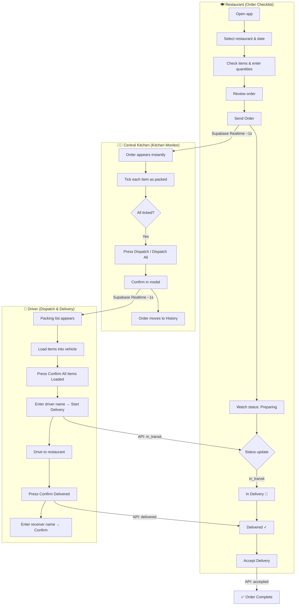
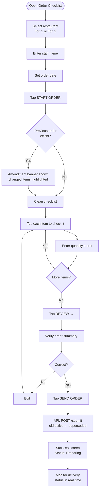
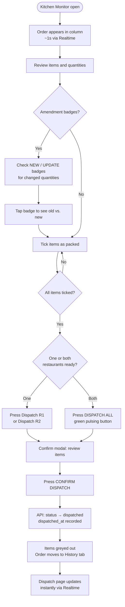
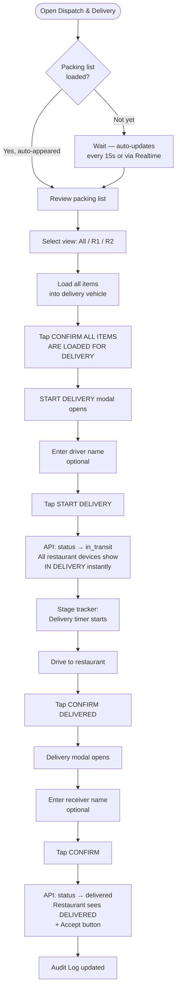
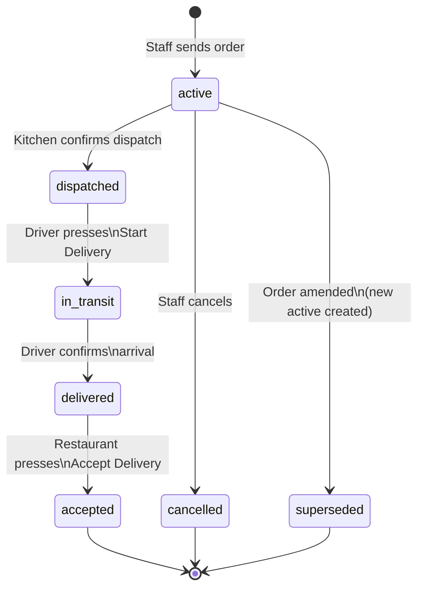
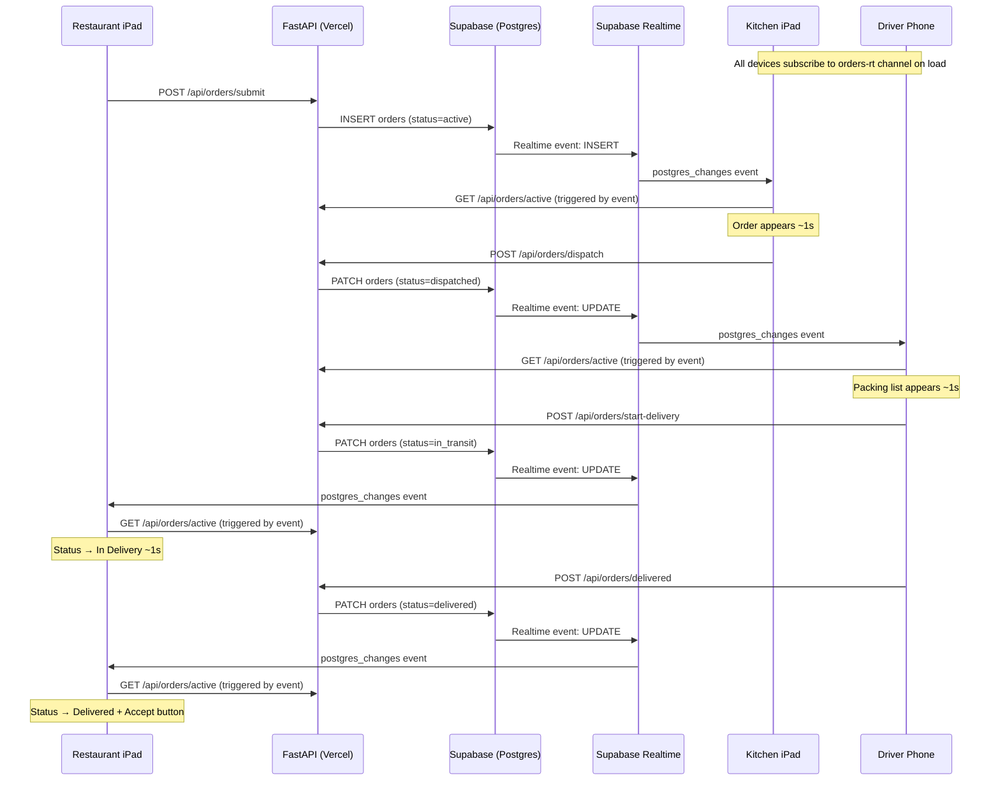

# TORI Kitchen Information System (KIS) v01
## Complete Project Documentation

**Version:** 1.0  
**Last updated:** 2026-06-29  
**Status:** Live in production

---

## Table of Contents

1. [Project Overview](#1-project-overview)
2. [Scope & Constraints](#2-scope--constraints)
3. [System Architecture](#3-system-architecture)
4. [Modules](#4-modules)
5. [Order Status Lifecycle](#5-order-status-lifecycle)
6. [Workflows & Diagrams](#6-workflows--diagrams)
7. [Voiceover Scripts — Module Walkthroughs](#7-voiceover-scripts--module-walkthroughs)

---

## 1. Project Overview

TORI KIS is a real-time kitchen information and order coordination system for TORI restaurant group. It connects two restaurant locations with a central kitchen, managing the full flow from order submission through preparation, dispatch, and delivery confirmation.

The system runs as a progressive web app on iPads at each location and on the delivery driver's phone. All devices stay in sync through Supabase Realtime WebSocket subscriptions, with a 15-second polling fallback for connection recovery.

**Locations served:**
| Key | Display Name |
|-----|-------------|
| r1 | Tori 1 — Špansko |
| r2 | Tori 2 — Trnje |

**Production URL:** `https://tori-kitchen-system.vercel.app`

---

## 2. Scope & Constraints

### In Scope
- Daily food order submission from two restaurant locations
- Real-time order monitoring at the central kitchen
- Dispatch coordination and packing list management
- Delivery tracking with driver start confirmation
- Delivery receipt acceptance by restaurant staff
- Prep checklist tracking at the central kitchen
- Order history and audit log

### Out of Scope
- POS or financial transactions
- Stock/inventory management
- Supplier ordering
- Nutritional or allergen tracking

### Locked Constraints (do not change without review)
- **Soft-delete only:** Order items are never hard-deleted. Removing an item sets `archived = true`.
- **Service-role writes only:** All data writes go through the FastAPI backend using the Supabase service-role key. The browser anon key has SELECT-only access on `orders` (for Realtime).
- **No build step:** All pages are self-contained static HTML with inline CSS and JS. No framework, no bundler.
- **Encoding:** HTML files must be saved as UTF-8 without BOM. Never use PowerShell `Set-Content -Encoding UTF8` on these files — it adds a BOM and corrupts Croatian characters (čšđž) on the Windows-1252 host.
- **Deployment pipeline:** GitHub is the single source of truth. Changes must be pushed to GitHub; Vercel deploys automatically from the main branch. Never edit the local Google Drive snapshot directly.

---

## 3. System Architecture

### Technology Stack

| Layer | Technology |
|-------|-----------|
| Frontend | Static HTML5 / CSS3 / Vanilla JS (no framework) |
| Backend API | FastAPI (Python) on Vercel Serverless |
| Database | Supabase (PostgreSQL) |
| Real-time | Supabase Realtime (`postgres_changes`) via `@supabase/supabase-js@2` |
| Hosting | Vercel (auto-deploy from GitHub main branch) |
| CDN | jsDelivr (Supabase JS client only) |

### Database Tables

| Table | Purpose |
|-------|---------|
| `orders` | All food orders — active, in-progress, historical |
| `order_items` | Master item catalog with units and categories |
| `order_units` | Unit definitions (kg, L, pcs, boxes, etc.) |
| `prep_logs` | Kitchen prep checklist submissions |
| `prep_tasks` | Custom prep task definitions |

### Key Database Configuration
- `orders` has RLS enabled with an anon `SELECT` policy (`USING (true)`) for Realtime.
- `orders` uses `REPLICA IDENTITY FULL` so UPDATE/DELETE events carry full row data for Realtime evaluation.
- `orders` is included in the `supabase_realtime` publication.

### `orders.status` Values (CHECK constraint enforced)

```
active → dispatched → in_transit → delivered → accepted
```

Also valid: `cancelled`, `superseded` (replaced by amended order).

### API Endpoints

| Method | Endpoint | Description |
|--------|----------|-------------|
| GET | `/api/orders/active` | Active orders, history, and active prep log |
| POST | `/api/orders/submit` | Submit a new order (supersedes previous active) |
| POST | `/api/orders/amend` | Amend an existing order |
| POST | `/api/orders/cancel` | Cancel active order |
| POST | `/api/orders/dispatch` | Kitchen dispatches orders → status: `dispatched` |
| POST | `/api/orders/start-delivery` | Driver starts delivery → status: `in_transit` |
| POST | `/api/orders/delivered` | Confirm delivery → status: `delivered` |
| POST | `/api/orders/accepted` | Restaurant accepts delivery → status: `accepted` |
| POST | `/api/prep/submit` | Submit or merge prep log |
| POST | `/api/prep/clear` | Mark active prep as cleared |
| POST | `/api/prep/tick` | Tick/untick individual prep item |
| GET | `/api/prep/tasks` | List custom prep tasks |
| POST | `/api/prep/tasks` | Save a new custom prep task |
| GET | `/api/prep/history` | Cleared prep history |

### Files

```
tori-kitchen-system/
├── api/
│   └── index.py                  # FastAPI backend (Vercel Serverless)
├── tori-order-checklist.html     # Module 1: Restaurant order submission
├── tori-kitchen-system.html      # Module 2: Central kitchen monitor
├── tori-dispatch-delivery.html   # Module 3: Dispatch & delivery
├── admin.html                    # Admin panel (user/item management)
├── vercel.json                   # Vercel routing config
└── requirements.txt              # Python dependencies
```

---

## 4. Modules

### Module 1 — Order Checklist (`tori-order-checklist.html`)

**Who uses it:** Restaurant staff (Tori 1 and Tori 2)  
**Device:** iPad at each restaurant location  
**Purpose:** Submit daily food orders to the central kitchen and track delivery status.

**Screens:**
1. **Welcome** — Select restaurant, enter staff name and order date
2. **Checklist** — Tap items to check them and enter quantities
3. **Review** — Confirm full order before sending
4. **Success / Status** — Live delivery tracking after order is sent

**Key features:**
- Item checklist organized by category (Produce, Proteins, Dairy, etc.)
- Quantity entry per item with unit display
- Amendment detection — if quantities changed from last order, an amber banner highlights the difference
- Real-time delivery status tracker (Preparing → In Delivery → Delivered)
- Amend order button to resubmit with changed quantities
- Cancel order option (while still active)
- Accept Delivery button — restaurant confirms receipt
- Order history tab

---

### Module 2 — Central Kitchen Monitor (`tori-kitchen-system.html`)

**Who uses it:** Head chef / kitchen coordinator  
**Device:** iPad or large display at the central kitchen  
**Purpose:** Monitor all incoming orders in real time, manage prep checklists, and dispatch orders when ready.

**Tabs:**
1. **Central** — Live dashboard showing orders from both restaurants side by side
2. **Prep** — Prep checklist history and management
3. **History** — Dispatch history log

**Central tab layout (3 columns):**
- **Prep column:** Today's prep checklist with tick-off items
- **Tori 1 — Špansko column:** Active order items for R1
- **Tori 2 — Trnje column:** Active order items for R2

**Key features:**
- Orders appear automatically within ~1 second of submission (Supabase Realtime)
- Individual item dispatch checkboxes — each item can be ticked off as packed
- Amendment badges — NEW (red) and UPDATE (amber) labels on changed items
- Dispatch buttons activate only when all items are ticked
- "Dispatch All" green button dispatches both restaurants simultaneously
- Dispatch confirmation modal lists all items before confirming
- API status indicator (green/red dot in top bar)
- Manual sync button (↻)
- Settings: force refresh, clear active orders, clear history

---

### Module 3 — Dispatch & Delivery (`tori-dispatch-delivery.html`)

**Who uses it:** Delivery driver / dispatch coordinator  
**Device:** Phone or tablet in the vehicle  
**Purpose:** View packing lists, confirm items are loaded, track delivery in progress, and confirm arrival.

**Tabs:**
1. **Packing Lists** — Active delivery view with stage tracker
2. **Audit Log** — Full delivery history

**Packing Lists tab:**
- View toggle: All / Restaurant 1 / Restaurant 2
- Stage tracker (Order → Prep → Delivery) with timestamps and elapsed timers
- Full item list per restaurant with quantities and units
- Items auto-appear within ~1 second of kitchen pressing DISPATCH (Supabase Realtime)

**Key features:**
- "Confirm All Items Are Loaded" button (green, pulsing) — triggers Start Delivery modal
- Start Delivery modal prompts for optional driver name, then calls `/api/orders/start-delivery`
- Starting delivery immediately shows "In Delivery" on all restaurant devices
- "Confirm Delivered" button (amber) — triggers delivery confirmation modal
- Delivery confirmation modal records receiver name and timestamp
- Audit Log shows full history of every delivery with item details

---

## 5. Order Status Lifecycle

```
Submitted        Kitchen packs      Driver loads       Driver arrives     Restaurant confirms
   │                  │                  │                   │                  │
active ──────► dispatched ──────► in_transit ──────► delivered ──────► accepted
   │
   ├──► superseded   (order was amended — replaced by new active order)
   └──► cancelled    (order cancelled before dispatch)
```

**What each status means for the UI:**

| Status | Order Checklist shows | Kitchen Monitor shows | Dispatch page shows |
|--------|-----------------------|-----------------------|---------------------|
| `active` | "Preparing" (green dot) | Order in column, items unticked | — |
| `dispatched` | "Preparing" (items packed, driver loading) | Items greyed out, dispatched | Packing list loaded |
| `in_transit` | "In Delivery" (green, pulsing) | Greyed out | Stage: Delivery, timer running |
| `delivered` | "Delivered" + Accept button | Moves to History | "Confirm Delivered" shown as done |
| `accepted` | "Accepted ✓" | In History | In Audit Log |

---

## 6. Workflows & Diagrams

### 6.1 Full System Workflow



---

### 6.2 Order Submission Flow (Restaurant Staff)



---

### 6.3 Kitchen Dispatch Flow (Central Kitchen)



---

### 6.4 Dispatch & Delivery Flow (Driver)



---

### 6.5 Order Status State Machine



---

### 6.6 Real-Time Sync Architecture



---

## 7. Voiceover Scripts — Module Walkthroughs

> These scripts are written for screen recording narration. Each step corresponds to a visible action on screen. Narrate each step as the action is performed.

---

### Script 1 — Ordering Food (Restaurant Staff)
**Module:** Order Checklist (`tori-order-checklist.html`)  
**Perspective:** Restaurant staff placing a daily food order

---

**[SCREEN: Welcome screen with TORI logo and restaurant selection]**

"This is the TORI Order Checklist — the app your restaurant staff uses every morning to send the food order to the central kitchen.

When you open the app, you'll see the welcome screen. Start by selecting your restaurant — tap either Tori 1 for Špansko, or Tori 2 for Trnje. The card highlights in red when selected.

Next, enter the name of the staff member placing the order in the Name field.

Then set the order date. It defaults to today, but you can change it if needed.

Tap the START ORDER button to open the checklist."

---

**[SCREEN: Checklist with categories and items]**

"The checklist opens with all food items organized by category — you'll see Produce, Proteins, Dairy, and so on. Categories are sticky, so the label stays visible as you scroll.

If quantities were different from your last order, you'll see an amber banner at the top saying items have been amended — and individual items will have red NEW or amber UPDATE badges. These show exactly what changed so nothing gets missed.

To order an item, tap its row. It expands — enter the quantity using the number field, then move on to the next item. Checked items show a green checkmark and their quantity. Unchecked items are grey — if you don't tap them, they won't be included.

Scroll through each category and check everything you need."

---

**[SCREEN: Review screen showing order summary]**

"When you've checked all your items, tap the REVIEW button at the bottom right.

The review screen shows your complete order — restaurant, date, staff name, and every item with its quantity. Take a moment to confirm everything looks right.

If you need to make a change, tap the Edit button to go back to the checklist.

When you're satisfied, tap SEND ORDER."

---

**[SCREEN: Success screen with green checkmark]**

"The order is sent. You'll see a green success confirmation — your order is now live at the central kitchen.

The screen switches to the status view, which shows the current stage of your order. Right now it says Preparing — the kitchen has received your order and is working on it.

You don't need to do anything else. Just leave the screen on and the status will update automatically."

---

**[SCREEN: Status updates to "In Delivery"]**

"When the driver loads the vehicle and starts the delivery run, your status automatically changes to In Delivery — you'll see the green pulsing indicator. You didn't need to refresh — the update arrived in real time.

The delivery tracker shows three stages: Preparing, In Delivery, and Delivered. The active stage pulses green."

---

**[SCREEN: Status updates to "Delivered" with Accept button]**

"When the driver arrives and confirms delivery on their end, your status immediately changes to Delivered.

You'll see a green Accept Delivery button. Once you've checked that everything arrived, tap it to confirm receipt. The order is now complete."

---

**[SCREEN: If amending an order — Amend button visible]**

"If you need to change your order before the kitchen dispatches it, tap Amend Order. This reopens the checklist with your current quantities pre-filled. Make your changes, go through review, and send again. The kitchen will see the updated quantities with amendment badges highlighting what changed."

---

### Script 2 — Monitoring & Dispatching Orders (Kitchen Staff)
**Module:** Central Kitchen Monitor (`tori-kitchen-system.html`)  
**Perspective:** Head chef or kitchen coordinator managing the daily orders

---

**[SCREEN: Central tab with 3-column layout]**

"This is the TORI Central Kitchen Monitor — the main screen for your kitchen team. It runs on a tablet or display in the central kitchen and stays open all day.

The screen has three columns: Prep on the left, and the two restaurant orders — Tori 1 Špansko and Tori 2 Trnje — on the right.

At the top you'll see the TORI logo with a pulsing red dot — that's your live connection indicator. The green dot in the top bar confirms the API is connected. Orders update automatically with no need to refresh."

---

**[SCREEN: New order appears in restaurant column]**

"When a restaurant sends an order, it appears in its column within about one second. You'll see the staff name, the order date, and all items organized by category.

If this restaurant has ordered before, any items with changed quantities will have badges — a red NEW badge for items not in the previous order, and an amber UPDATE badge for changed quantities. Tap any badge to see the old value versus the new value."

---

**[SCREEN: Ticking items in the dispatch list]**

"As your kitchen team prepares each item, tick the checkbox next to it. The item turns grey with a green checkmark — this tells everyone that item is packed and ready.

Work through each category. You can tick items in any order. The footer shows a running count: how many items are dispatched versus the total."

---

**[SCREEN: Dispatch button activates when all items ticked]**

"Once all items in a restaurant's column are ticked, the Dispatch button for that restaurant becomes active. If both restaurants are ready at the same time, the green DISPATCH ALL button appears and pulses — this is the most common action when both orders go out together.

Tap DISPATCH ALL — or the individual dispatch button if only one restaurant is ready."

---

**[SCREEN: Dispatch confirmation modal]**

"A confirmation modal appears showing every item being dispatched across both restaurants. Review the list one final time.

Tap CONFIRM DISPATCH. The orders are sent — status changes to dispatched, the timestamp is recorded, and the driver's dispatch page updates automatically."

---

**[SCREEN: Items greyed out, order moves to history area]**

"The columns grey out to show the dispatch is complete. You'll see the dispatch time recorded in the column header.

The dispatch page on the driver's phone has already updated with the packing list — they'll see it appear within about a second.

Switch to the History tab at any time to see a full log of all dispatches with timestamps, items, and who dispatched them."

---

**[SCREEN: Prep column with checklist items]**

"The Prep column on the left is separate from orders — it shows today's prep checklist submitted by the head chef. Tick items as the team completes each prep task.

When all prep items are ticked, a green Clear Prep List button appears. Tap it to archive the list — it moves to Prep History and the column resets for the next submission."

---

### Script 3 — Delivery (Driver)
**Module:** Dispatch & Delivery (`tori-dispatch-delivery.html`)  
**Perspective:** Delivery driver managing the daily food run

---

**[SCREEN: Packing Lists tab with stage tracker]**

"This is the TORI Dispatch and Delivery app — it runs on the driver's phone and manages everything from packing through to delivery confirmation.

The main screen is the Packing Lists tab. At the top you'll see the stage tracker — three stages: Order, Prep, and Delivery. Each shows a timestamp and elapsed time. The current stage is highlighted.

At the top right you'll see the clock and today's date."

---

**[SCREEN: Packing list appears after kitchen dispatches]**

"As soon as the kitchen presses Dispatch, your packing list appears automatically — usually within a second. No refresh needed.

You'll see both restaurant orders side by side — Tori 1 on the left and Tori 2 on the right. Use the view toggle at the top to switch to a single-restaurant view if you prefer.

Each section is organized by category. Items show the item name, quantity, and unit — for example, 25 kg, or 12 L. Work through the list and load everything into the vehicle."

---

**[SCREEN: Green "Confirm All Items Are Loaded" button pulsing]**

"When everything is loaded and you're ready to go, tap the green Confirm All Items Are Loaded for Delivery button. It pulses to draw your attention when the packing list is ready.

A modal appears — Start Delivery. You can enter your name here, or leave it blank. Tap START DELIVERY."

---

**[SCREEN: Stage tracker advances to Delivery, timer starts]**

"The delivery is now officially started. The stage tracker advances to Delivery and the timer starts counting.

At the same moment, every restaurant device updates automatically — staff at Tori 1 and Tori 2 both see their status change to In Delivery. They know the food is on the way without anyone needing to call or message."

---

**[SCREEN: Driving — timer visible]**

"Drive to the restaurants. The timer continues running so you have a clear record of delivery time.

If you deliver to both restaurants in sequence, the single delivery run covers both orders."

---

**[SCREEN: "Confirm Delivered" amber button]**

"When you arrive and hand over the delivery, tap the Confirm Delivered button — it's the large amber button in the centre of the screen.

A confirmation modal opens. Enter the name of the person who received the delivery — this is optional but useful for the audit log. Tap CONFIRM."

---

**[SCREEN: Status updates, audit log records the delivery]**

"Delivery is confirmed. The restaurant devices immediately update — staff see Delivered and an Accept Delivery button appears for them to tap once they've checked the items.

Your Audit Log tab records the full delivery: restaurant, driver, receiver, items, and timestamps. This is your complete paper trail for every delivery.

Switch to the Audit Log tab at any time to review past deliveries."

---

**[SCREEN: Audit Log with delivery cards]**

"The Audit Log shows every delivery as a card — restaurant tag, stage, status, time, and a summary of items delivered. Green means completed. Tap any card to see the full details including individual item quantities.

This log is permanent and searchable, making it easy to resolve any questions about what was delivered and when."

---

---

*End of documentation.*

*For technical changes to this system, refer to the Architecture section and the constraint list in Section 2 before making modifications. All code changes must go through the GitHub → Vercel pipeline.*
